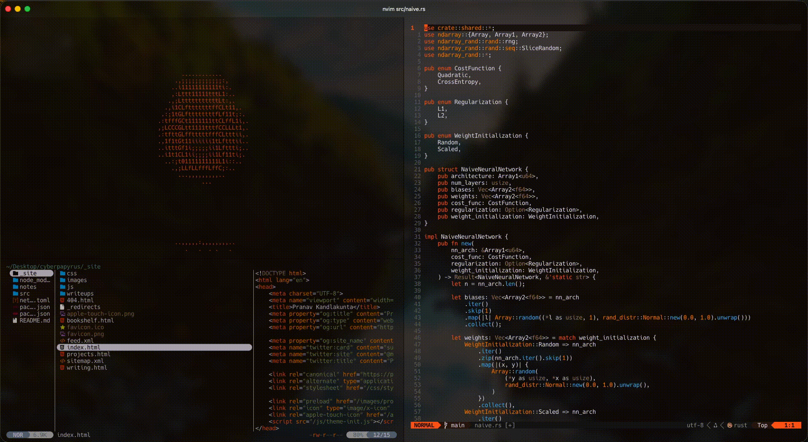

# ·✦ ρĸs terminal ✧°⊹·
Collection of Ghostty, Neovim, yazi, and zsh configs I use

**Highlights**

→ Light / Dark themes across ghostty, zsh, and nvim that align with my personal website, pranavdotcom 
→ Window pane screensaver utilizing ascii art animation (source: https://ascii.co.uk/animated-art/line-cube-animated-ascii-art.html) 
→ Feel free to use install.sh to download my setup and try it out for yourself 

